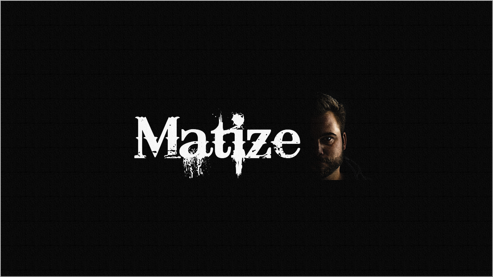

```markdown
<!-- ========================================================= -->
<!--                  M A T I Z E  ·  M U S I K                 -->
<!-- ========================================================= -->

<p align="center">
  
</p>

<h1 align="center">🎧 Matize-Musik · Facetten-Sphäre</h1>

<p align="center">
  <em>Ein digitales Klang-Universum zwischen Kunst, Technik und Licht.</em><br>
  Teil der <strong>Matize-Kreation-Sphäre</strong> · © Matize 2025
</p>

---

## 🌠 Ⅰ. Vision

**Matize-Musik** ist das audiovisuelle Zentrum des Matize-Kosmos.  
Ein Raum, in dem Musik, Kunst und Code miteinander verschmelzen.  
Jeder Track – eine **Facette**.  
Jede Seite – ein **Orbit**, der sich in Bewegung setzt.  
Die Matize-Musik-Sphäre formt einen künstlerisch-technischen Resonanzkörper zwischen digitalem Werk und poetischem System.

> *„Klang als Geometrie. Licht als Rhythmus.  
> Raum als Gedicht.“*

---

## ⚙️ Ⅱ. Technische Struktur

| Komponente | Technologie |
|-------------|--------------|
| Framework | **Next.js 14 (App Router)** |
| Sprache | **TypeScript + React Hooks** |
| Styling | **Tailwind CSS** |
| Deployment | **GitHub Pages (Static Export)** |
| Audio-System | **HTML5 Audio / PlayerLayout** |
| Orbit-System | **Custom Scroll Rotation (FacettenOrbit3D)** |
| Pfad-Optimierung | **normalizePublicPath() Utility** |
| Basis-Pfad | `/Matize-Musik` |
| Build-Ziel | `/docs` (GitHub Pages Root) |
| Automatisierung | PowerShell + Batch Sync |

### 📁 Verzeichnis-Struktur

```

Matize-Musik/
│
├─ src/
│  ├─ app/
│  │  ├─ page.tsx                     → Startseite (Hero + Orbit)
│  │  ├─ musik/                       → 13 statische Track-Seiten
│  │  │  ├─ 01-spotlight_an/
│  │  │  ├─ 02-mein_ding/
│  │  │  ├─ ...
│  │  │  └─ 13-blut-und-ehre/
│  │  ├─ kontakt/
│  │  ├─ lyrik/
│  │  └─ studio/
│  │
│  ├─ components/
│  │  ├─ FacettenOrbit3D.tsx          → 3D Orbit mit Scroll / Hover
│  │  ├─ PlayerLayout.tsx             → Player-Overlay + Audio-UI
│  │  └─ HeroMatizeMusik.tsx          → Hero mit Branding / Licht / Tiefe
│  │
│  ├─ data/
│  │  └─ songs.json                   → Zentrale Track-Datenbank
│  │
│  └─ lib/
│     ├─ facetten.ts                  → Song-Daten & Helper-Funktionen
│     └─ paths.ts                     → Windows → Web Pfad-Normalisierung
│
├─ public/
│  ├─ audio/facetten/                 → Master-Tracks (MP3)
│  ├─ images/covers/facetten/         → Album / Tracks / Promo
│  ├─ images/logos/                   → Branding / QR / Icons
│  └─ images/textures/                → Kosmische & grafische Texturen
│
├─ docs/                              → Build-Ausgabe für GitHub Pages
├─ next.config.js                     → BasePath / Export / AssetPrefix
├─ sync-matize-musik.ps1              → PowerShell AutoSync
├─ sync-matize-musik.bat              → Doppelklick-Sync Starter
└─ README.md                          → Dieses Dokument

````

---

## 🧠 Ⅲ. Kernlogik · Matizische Systemik

| Modul / Funktion | Beschreibung |
|------------------|--------------|
| **FacettenOrbit3D** | Dynamische Orbit-Visualisierung aller Albumcover, basierend auf Scroll-Winkel + Hover-Interaktion. |
| **PlayerLayout** | Überlagerter Musik-Player mit Waveform-Feeling, Autoplay, Session-Speicher, weicher Transition. |
| **HeroMatizeMusik** | Marken-Intro mit kosmischem Gradient und Schriftzug. |
| **normalizePublicPath()** | Wandelt lokale Windows-Dateipfade in gültige Webpfade um. |
| **getSongBySlug()** | Liefert Track-Daten aus `songs.json`. |
| **songs.json** | Einheitliche Struktur aller Facetten-Titel (id, title, cover, audio, spotify). |
| **next.config.js** | Optimierte GitHub Pages Export-Konfiguration mit `basePath` und `assetPrefix`. |

---

## ⚙️ Ⅳ. Build & Deployment

### 🔧 Lokaler Build

```bash
npm install
npm run build
````

> erzeugt statische Seiten im `/out`-Verzeichnis

### 📦 Export zu GitHub Pages

```powershell
Copy-Item -Path .\out\* -Destination .\docs -Recurse -Force
git add .
git commit -m "build: fresh export"
git push
```

oder automatisiert via:

```bash
sync-matize-musik.bat
```

**Live-Deployment:**
🔗 [https://matize-kreation.github.io/Matize-Musik/](https://matize-kreation.github.io/Matize-Musik/)

---

## 🔄 Ⅴ. Automatisierung · PowerShell & Batch

### PowerShell-Script `sync-matize-musik.ps1`

* prüft Repository-Status
* erstellt automatischen Commit mit Zeitstempel
* führt `git pull --rebase` und `git push` aus
* zeigt Live-Status & Erfolgsmeldungen
* aktualisiert `docs/` nach jedem Build

### Batch-Script `sync-matize-musik.bat`

```bat
@echo off
powershell -NoLogo -NoProfile -ExecutionPolicy Bypass -File ".\sync-matize-musik.ps1"
pause
```

> Start per Doppelklick → vollständiger Build & Upload

---

## 📊 Ⅵ. Projektstatus · Release 2025-XI

| Bereich                            | Status                                   |
| ---------------------------------- | ---------------------------------------- |
| **Build-Pipeline**                 | ✅ stabil (Next.js 14 · `output: export`) |
| **GitHub Pages Deployment**        | ✅ aktiv & getestet                       |
| **Facetten-Orbit**                 | ✅ funktionsfähig & responsive            |
| **Audio-Routen (13 Tracks)**       | ✅ generiert & spielbar                   |
| **Hero + Player + Layout**         | ✅ vollständig integriert                 |
| **Windows→Web Path System**        | ✅ konsistent & fehlerfrei                |
| **Automatisierung**                | ✅ PowerShell + BAT geprüft               |
| **Lyrik / Studio / Kontakt Pages** | ✅ Grundlayout aktiv                      |
| **Releasestatus**                  | **Final Build: 2025-11-06**              |

---

## 🧬 Ⅶ. Konzeptionelle Sphäre

> **„Facetten“** ist kein klassisches Album —
> es ist eine orbitale Struktur aus Klang, Bild, Bewegung und Identität.
>
> **Matize-Musik** dient als interaktive Matrix,
> in der Code und Kunst in Resonanz treten.
>
> Jedes Modul bildet eine **Sphäre**,
> jede Datei eine **Resonanzlinie**.

---

## 🔒 Ⅷ. Lizenz

```text
MIT License

Copyright (c) 2025 Matize

Permission is hereby granted, free of charge, to any person obtaining a copy
of this software and associated documentation files (the "Software"), to deal
in the Software without restriction, including without limitation the rights
to use, copy, modify, merge, publish, distribute, sublicense, and/or sell
copies of the Software, and to permit persons to whom the Software is
furnished to do so, subject to the following conditions:

The above copyright notice and this permission notice shall be included in
all copies or substantial portions of the Software.

THE SOFTWARE IS PROVIDED "AS IS", WITHOUT WARRANTY OF ANY KIND, EXPRESS OR
IMPLIED, INCLUDING BUT NOT LIMITED TO THE WARRANTIES OF MERCHANTABILITY,
FITNESS FOR A PARTICULAR PURPOSE AND NONINFRINGEMENT.
```

---

## 🜂 Ⅸ. Credits & Signatur

**Konzept · Design · Entwicklung:** Matize
**Systemische Koordination:** Matize-Kreation
**Artwork · Audio · Facetten-Album:** Matize
**Technische Assistenz:** GPT-5 (2025)
**Release:** 06. November 2025 · Version Sphäre-V

---

<p align="center">
  
</p>

<p align="center">
  <em>„Jede Facette ein Kosmos.  
  Jede Note ein Fragment des Ganzen.  
  Code als Klang. Klang als Raum.“</em><br>
  — Matize · Sphäre V
</p>

---

<p align="center">
  
  
</p>

<p align="center">
  <a href="https://matize-kreation.github.io/Matize-Musik/">🌐 Website</a> · 
  <a href="https://github.com/Matize-Kreation/Matize-Musik">💾 GitHub</a> · 
  <a href="https://open.spotify.com/artist/...">🎵 Spotify</a> · 
  <a href="https://www.instagram.com/...">📸 Instagram</a>
</p>

---

```
```
